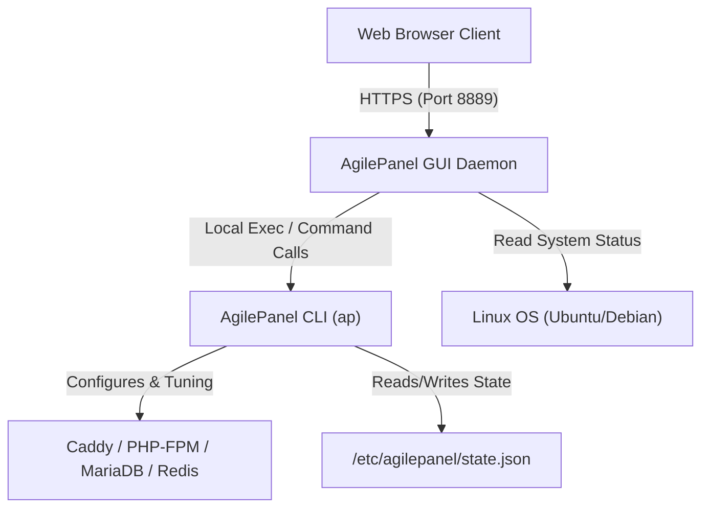

# 👑 AgilePanel GUI — Interactive Web Dashboard

<p align="center">
  <a href="https://github.com/webtechj/agilepanel-gui/releases"></a>
  <a href="https://github.com/webtechj/agilepanel-gui/tree/development"></a>
  
  
</p>

**AgilePanel GUI** is a premium web dashboard companion for **AgilePanel (ap)**. It runs on port `8889`, rendering real-time performance analytics and system orchestration capabilities via a gorgeous, responsive, glassmorphic browser interface.

Under the hood, AgilePanel GUI acts as a secure, local web wrapper around the compiled `ap` CLI tool, ensuring that every operation carried out in the dashboard mirrors the commands executed via SSH.

---

## 🏗️ System Architecture



---

## ⚡ Key Features

*   🌌 **Glassmorphic Server Health Panel**: Monitor CPU load, RAM utilization, active sites, swap file allocation, and disk storage metrics with real-time dynamic gauges.
*   🚀 **Instant Site Provisioning Wizard**: Set up WordPress, WooCommerce, Laravel, Static HTML, or generic PHP sites instantly.
*   ⚙️ **System Services Command Center**: Restart, stop, or start underlying daemons (Caddy web server, MariaDB, Redis caching, PHP-FPM pools) directly from the browser.
*   ☁️ **Offsite Backup Orchestrator**: Schedule local backups or offsite S3 Cloud uploads, customize storage destinations, and monitor recent backup history.
*   📁 **Full-Featured Web File Manager**: Read, write, create, delete, rename, upload, zip, and unzip web directory files.
*   📺 **Simulated Stream Terminal**: View real-time console outputs, stdout logs, and script warnings of background execution processes in a live browser terminal window.

---

## 📥 Installation & Command Reference

> [!IMPORTANT]
> **AgilePanel GUI requires the main AgilePanel CLI (`ap`) to be installed first.**
> Install it from [webtechj/agilepanel](https://github.com/webtechj/agilepanel) before proceeding.

The AgilePanel GUI dashboard is installed and managed directly via the main **AgilePanel CLI (`ap`)**.

### 1. Install the Web GUI

Run on your VPS after AgilePanel is installed. This always downloads the **latest stable release**:

```bash
sudo ap install gui
```

This automatically downloads the companion binary from the latest GitHub Release, configures a systemd daemon, and opens port `8889`.

### 2. Service Management Commands

| Command | Description |
| :--- | :--- |
| `sudo ap gui enable` | Start the dashboard service and open port `8889` |
| `sudo ap gui disable` | Stop the service and block port `8889` access |
| `sudo ap gui update` | Download the latest stable release and restart the daemon |

*The panel will be accessible at `http://[your-server-ip]:8889` after enabling.*

---

## 🔀 Development Branch (Advanced)

> [!WARNING]
> The `development` branch contains unreleased work and may be unstable. Only use this on test VPS instances.

To install from the development branch:
```bash
# Set the override before running ap install gui
export AGILEPANEL_UPDATE_BRANCH=development
sudo -E ap install gui
```

To keep a dev VPS always updating from the development branch:
```bash
# Add to /etc/environment on the dev VPS
echo 'AGILEPANEL_UPDATE_BRANCH=development' | sudo tee -a /etc/environment
```

---

## 📄 License
This project is licensed under the MIT License - see the [LICENSE](LICENSE) file for details.
