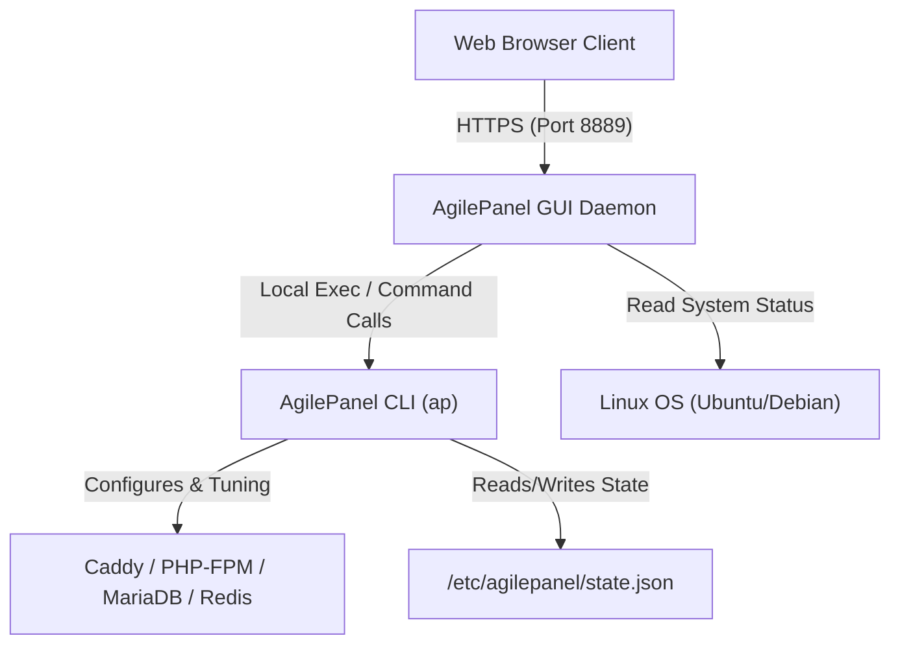

# 👑 AgilePanel GUI — Interactive Web Dashboard

[](https://github.com/webtechj/agilepanel-gui)
[](https://golang.org)
[](https://ubuntu.com)

**AgilePanel GUI** is a premium web dashboard companion for **AgilePanel (ap)**. It runs on port `8889`, rendering real-time performance analytics and system orchestration capabilities via a gorgeous, responsive, glassmorphic browser interface.

Under the hood, AgilePanel GUI acts as a secure, local web wrapper around the compiled `ap` CLI tool, ensuring that every operation carried out in the dashboard mirrors the commands executed via SSH.

---

## 🏗️ System Architecture



---

## ⚡ Key Features

*   🌌 **Glassmorphic Server Health Panel**: Monitor CPU load, RAM utilization, active sites, swap file allocation, and disk storage metrics with real-time dynamic gauges.
*   🚀 **Instant Site Provisioning Wizard**: Set up WordPress, WooCommerce, Laravel, Static HTML, or generic PHP sites instantly.
*   ⚙️ **System Services Command Center**: Restart, stop, or start underlying daemons (Caddy web server, MariaDB, Redis caching, PHP-FPM pools) directly from the browser.
*   ☁️ **Offsite Backup Orchestrator**: Schedule local backups or offsite S3 Cloud uploads, customize storage destinations, and monitor recent backup history.
*   📁 **Full-Featured Web File Manager**: Read, write, create, delete, rename, upload, zip, and unzip web directory files.
*   📺 **Simulated Stream Terminal**: View real-time console outputs, stdout logs, and script warnings of background execution processes in a live browser terminal window.

---

## 📥 Installation & Command Reference

The AgilePanel GUI dashboard is installed and managed directly via the main **AgilePanel CLI (`ap`)**.

### 1. Installation
To install the Web GUI dashboard companion, run:
```bash
sudo ap install gui
```
This automatically downloads, configures, and prepares the companion background daemon.

### 2. Service Management Commands

*   **Enable/Start the GUI**:
    To start the dashboard service and open the access port, run:
    ```bash
    sudo ap gui enable
    ```
    *The panel will be accessible at `http://[your-server-ip]:8889`.*

*   **Disable/Stop the GUI**:
    To stop the background service and block/restrict port access, run:
    ```bash
    sudo ap gui disable
    ```

*   **Update the GUI**:
    To fetch and update the GUI companion binary to the latest version, run:
    ```bash
    sudo ap gui update
    ```

---

## 📄 License
This project is licensed under the MIT License - see the [LICENSE](LICENSE) file for details.
