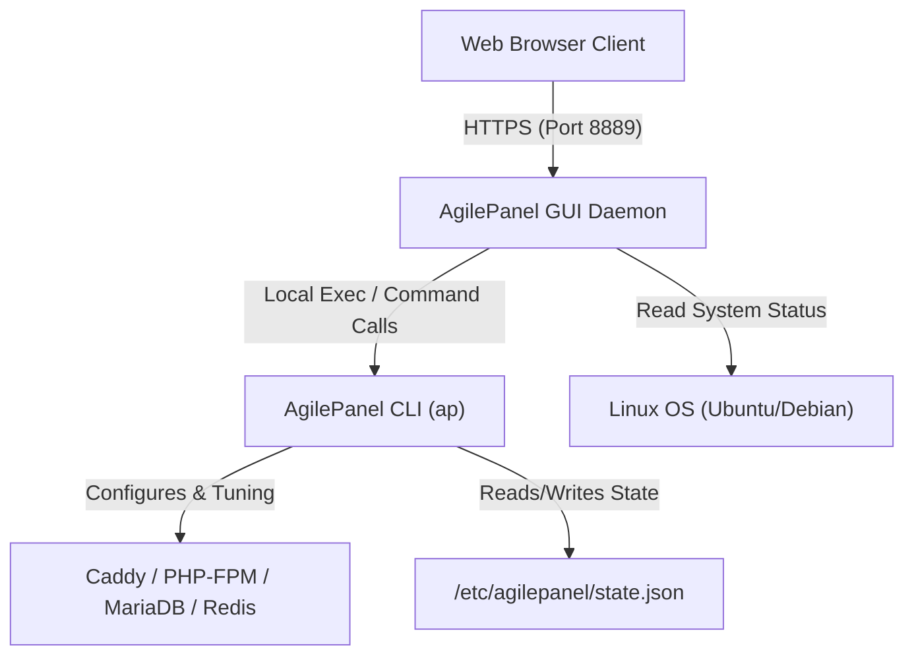

# 👑 AgilePanel GUI — Interactive Web Dashboard

[](https://github.com/webtechj/agilepanel-gui)
[](https://golang.org)
[](https://ubuntu.com)

**AgilePanel GUI** is a premium, single-binary companion dashboard for **AgilePanel (ap)**. It runs on a secure port (`8889`), rendering real-time performance analytics and system orchestration capabilities via a gorgeous, responsive, glassmorphic web browser interface.

Under the hood, AgilePanel GUI acts as a secure, local web wrapper around the compiled `ap` CLI tool, ensuring that every operation carried out in the dashboard mirrors the exact high-performance commands executed via SSH.

---

## 🏗️ System Architecture



---

## ⚡ Key Features

*   🌌 **Glassmorphic Server Health Panel**: Monitor CPU load, RAM utilization, active sites, swap file allocation, and disk storage metrics with real-time dynamic gauges.
*   🚀 **Instant Site Provisioning Wizard**: Set up WordPress, WooCommerce, Laravel, Static HTML, or generic PHP sites instantly.
*   ⚙️ **System Services Command Center**: Restart, stop, or start underlying daemons (Caddy web server, MariaDB, Redis caching, PHP-FPM pools) directly from the browser.
*   🔒 **Enterprise Tuning & Hardening**: Run system audits (`ap server tune`), configure security policies (`ap server secure`), manage firewall rules, and adjust global configurations with a simple button click.
*   ☁️ **Offsite Backup Orchestrator**: Schedule local backups or offsite S3 Cloud uploads, customize storage destinations, and monitor recent backup history.
*   📁 **Full-Featured Web File Manager**: Read, write, create, delete, rename, upload, zip, and unzip web directory files securely.
*   📺 **Simulated Stream Terminal**: View real-time console outputs, stdout logs, and script warnings of background execution processes in a live browser terminal window.

---

## 🔒 Security Practices

Security is the core pillar of AgilePanel. The GUI is built to ensure a zero-attack-surface approach:

1.  **Local Cryptographic Verification**: Authentication credentials utilize secure bcrypt hashing. If global admin configurations are missing, a warning banner is displayed prompting you to configure access.
2.  **No Telemetry & Offsite Logging**: Unlike centralized SaaS control panels, AgilePanel GUI runs entirely on your own local server and never phones home.
3.  **Strict File Permissions**: The web server requires system authentication and basic authentication tokens. Secondary session validation is enforced across all core stateful actions.

---

## 📥 Installation & Setup

AgilePanel GUI runs as a systemd service daemon under root to allow it to execute underlying CLI actions.

### 1. Compile the Binary
Build the GUI binary directly on your VPS (ensuring Go 1.20+ is installed):
```bash
git clone https://github.com/webtechj/agilepanel-gui.git
cd agilepanel-gui
go build -o /usr/local/bin/agilepanel-gui main.go
```

### 2. Configure the Systemd Daemon
Create a systemd unit file at `/etc/systemd/system/agilepanel-gui.service`:
```ini
[Unit]
Description=AgilePanel Web GUI Daemon
After=network.target caddy.service mariadb.service

[Service]
Type=simple
User=root
WorkingDirectory=/usr/local/bin
ExecStart=/usr/local/bin/agilepanel-gui
Restart=always
RestartSec=5

[Install]
WantedBy=multi-user.target
```

Apply changes, register and start the daemon:
```bash
systemctl daemon-reload
systemctl enable agilepanel-gui
systemctl start agilepanel-gui
```

### 3. Open UFW Access Port
Allow the GUI port (8889) in UFW:
```bash
ufw allow 8889/tcp
```

Your AgilePanel GUI dashboard is now available at `http://[your-server-ip]:8889`. 
> [!TIP]
> For production environments, it is recommended to proxy the dashboard through Caddy with SSL enabled.

---

## 📄 License
This project is licensed under the MIT License - see the [LICENSE](file:///d:/repos/agilepanel-gui/LICENSE) file for details.
